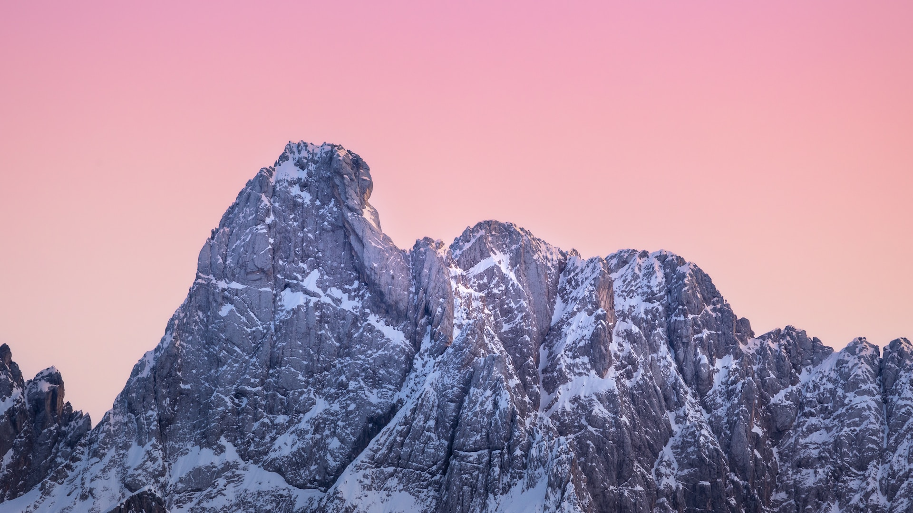

# SVG guide

SVG (Scalable Vector Graphics) - векторный формат графики, который имеет ряд преимуществ:

- Масштабируемость. _Высокое качество изображения при масштабировании._
- Компактность. По сравнению с растровыми форматами, такими как `jpg, png` имеет меньший вес
- Интерактивность. SVG поддерживает добавление интерактивности и анимации

Из минусов самым главным, пожалуй, является, фотореалистичность. В этом плане растровый формат показывает себя гораздо лучше.

---

Часто мы сталкиваемся с задачей создать какую-то простую фигуру для сайта - круг, квадрат и т.д. Иногда необходимо подправить уже существующий файл. Для этого необходимо знать основы SVG формата и это сильно облегчит работу веб-разработчику.

## Создание фигур

> Для удобоства чтения везде в основном используются атрибуты тегов, но у всех атрибутов есть одноименные свойства в CSS и при работе лучше использовать их.

### Прямоугольник

Для создания прямоугольника используется тег **`<rect>`**.

```html
<svg class="svg">
  <rect
    width="200"
    height="150"
    fill="#3f31a2"
    x="100"
    y="75"
    rx="15"
    ry="20"
  />
</svg>
```

**Ширина(width) и высота(height)** указыватся в пикселях или процентах, если ничего не указывать, то по-умолчанию будут пиксели.

Также у всех фигур по-умолчанию идёт **заливка** чёрным цветом. За заливку отвечает атрибут **`fill`**.

**Координаты** обозначаются буквами **`x`** и **`y`**. По-умолчанию их значениями является «0». Началом координат прямоугольника является верхний левый угол.

Для **скругления углов** есть артибуты **`rx`** и **`ry`**. Если указать только один из этих атрибутов, то второй будет равен заданному.


---

### Круг

Для создания круга используется тег **`<circle>`**.

```html
<svg class="svg">
  <circle r="100" fill="#14f112" cx="50%" cy="50%" />
</svg>
```

**Размер** круга определятся его **радиусом**. Для этого используется атрибут **`r`**.

**Координаты** круга назначаются атрибутами **`cx`** и **`cy`**. По-умолчанию, их значения равны «0». Началом координат является центр круга.


---

### Эллипс (овал)

Для создания эллипса используется тег **`<ellipse>`**

```html
<svg class="svg">
  <ellipse rx="50" ry="50" fill="gold" cx="50%" cy="50%" />
</svg>
```

**Размер** эллипса определяется его радиусами по ширине (ось x) **`rx`** и высоте (ось y) **`ry`**.

**Координаты** также как и у круга назначаются атрибутами **`cx`** и **`cy`**. По-умолчанию, их значения равны «0». Началом координат является центр эллипса.


---

### Многоугольник

Для создания многоульника используется тег `<polygon>`.

```html
<svg class="svg">
  <polygon points="100,225 300,225 200,75" fill="#31C6D4" />
</svg>
```

Чтобы создать, например, треугольник необходимо задать координаты по осям «x» и «y» для **3 точек**.

Для указания **координат** точек используется тег **`<points>`**. Координаты одной точки указываются через запятую и отделяются пробелом от следующей.


---

### Линия

Для создания многоульника используется тег **`<line>`**.

```html
<svg class="svg">
  <line x1="100" y1="150" x2="300" y2="150" stroke="#FF1E1E" stroke-width="2" />
</svg>
```

Чтобы создать линию нужно указать **координаты начала `x1, y1`** и **координаты конца `x2, y2`**.

**Цвет линии** задаётся атрибутом **`stroke`**.

**Толщина линии** задаётся атрибутом **`stroke-width`**.


---

### Ломаная линия

Для создания ломаной линии используется тег **`<polyline>`**.

```html
<svg class="svg">
  <polyline
    points="50,250 160,100 230,210 350,250 350,50"
    stroke="#9384D1"
    fill="none"
    stroke-width="10"
  />
</svg>
```

Чтобы создать ломаную линию необходимо указать координаты точек.

Для указания **координат** используется тег **`<points>`**. Координаты одной точки указываются через запятую и отделяются пробелом от следующей.

**Цвет линии** задаётся атрибутом **`stroke`**.

По-умолчанию создаётся заливка чёрного цвета, чтобы её убрать нужно атрибуту **`fill`** задать значение `none`.

**Толщина линии** задаётся атрибутом **`stroke-width`**.

**Плавность изгибов линии** задаётся атрибутом **`stroke-linejoin`**. По-умолчанию используется значение **miter**, но также есть **bevel** (срезанные края), **round** (закруглённые края) и др.

> Атрибуты **`stroke`** и **`stroke-width`** можно задать любой фигуре


---

### Кривая линия

Чтобы создать плавную кривую линию необходимо использовать тег **`<path>`**, но вручную прописывать все координаты достаточно долго, поэтому можно воспользоваться графическим редактором «Figma».

Рисуем кривую -> копируем как SVG -> вставляем полученный код в HTML

```html
<svg
  class="svg-text"
  width="352"
  height="252"
  viewBox="0 0 352 252"
  fill="none"
  xmlns="http://www.w3.org/2000/svg"
>
  <path
    d="M265.439 251C69.7457 145.133 264.424 -69.1267 337.559 23.8037C426.127 136.344 49.8402 119.246 1 150.306"
    stroke="#B5F1CC"
    stroke-width="5"
  />
</svg>
```


---

### Текст внутри SVG

В тег **`<svg>`** можно вставлять текст с помощью тега **`<text>`**. Цвет текста задаётся атрибутом **fill**.

Также, есть возможность расположить текст по траектории кривой.
Для этого нужно создать тег **`<textPath>`** внутри тега **`<text>`** и задать ему в атрибуте **`href`** **id**.

После этого необходимо задать данный **id** тегу **`<path>`**

> Если задать атрибуту **stroke** значение **«transparent»**, то линия исчезнет и останется только текст.

```html
<svg
  class="svg_2"
  width="352"
  height="252"
  viewBox="0 0 352 252"
  fill="none"
  xmlns="http://www.w3.org/2000/svg"
>
  <path
    id="path"
    d="M265.439 251C69.7457 145.133 264.424 -69.1267 337.559 23.8037C426.127 136.344 49.8402 119.246 1 150.306"
    stroke="#B5F1CC"
    stroke-width="5"
  />
  <text class="svg__text">
    <textPath href="#path">
      Lorem ipsum dolor sit amet, consectetur adipisicing elit. Porro tempora
      non ullam perferendis consequatur rem, minima quidem eos, fugiat impedit
      commodi autem cumque expedita hic eligendi fuga, harum ex atque.
    </textPath>
  </text>
</svg>
```


---

## Атрибуты

### Stroke-dasharray

Такая запись **«stroke-width="70"»** означает, что 35px пойдёт внутрь круга и 35px наружу.

Атрибут **«stroke-dasharray»** позволяет создать пробелы в линии. Такая запись **«stroke-dasharray="20"»** означает, что ширина линии будет равна 20px, затем пробел, который также будет равен 20px.

Если указать второе значение **«stroke-dasharray="20 10"»**, то ширина линии будет 20px, а ширина пробела 10px.

Можно задать значения таким образом **«stroke-dasharray="20 10 15 25"»**. Это значит, что толщина линии будет 20, потом пробел 10, следующая линия 15, потом пробел 25.

```html
<svg class="svg">
  <circle
    r="100"
    fill="#03C988"
    cx="50%"
    cy="50%"
    stroke="#1C82AD"
    stroke-width="70"
    stroke-dasharray="20 10"
  />
</svg>
```


---

Даже с таким несложным набором атрибутов, комбинируя различные фигуры, можно создавать интересные изображения.

Например:

```html
<svg class="svg">
  <circle r="100" fill="#F9D923" cx="50%" cy="50%" />
  <circle
    r="50"
    fill="#F9D923"
    cx="50%"
    cy="50%"
    stroke="#EB5353"
    stroke-width="100"
    stroke-dasharray="20"
    stroke-dashoffset="10"
  />
</svg>
```

Атрибут **«stroke-dashoffset="10"»** позволяет сдвигать линию на число указанное в значении. Это нужно, чтобы, например, отцентровать что-то относительно чего-то. Может принимать отрицательные значения и в таком случае сдвиг будет по часовой стрелке.


---

## SVG-маска

Можно задать маску любому изображению, используя атрибут **«clip-path»**.

Сайт с готовыми масками - <https://bennettfeely.com/clippy/>

```css
.img {
  height: 400px;
  clip-path: polygon(
    20% 0%,
    0% 20%,
    30% 50%,
    0% 80%,
    20% 100%,
    50% 70%,
    80% 100%,
    100% 80%,
    70% 50%,
    100% 20%,
    80% 0%,
    50% 30%
  );
}
```


## SVG-маска 2

Для создания SVG-маски из любого изображения необходимо поместить содержимое тега **`path`** в тег **`clipPath`** и задать **`clipPath`** атрибут **id**.

```html
<svg
  class="telegram-2"
  xmlns="http://www.w3.org/2000/svg"
  viewBox="0 0 496 512"
>
  <clipPath id="telegram">
    <path
      d="M248,8C111.033,8,0,119.033,0,256S111.033,504,248,504,496,392.967,496,256,384.967,8,248,8ZM362.952,176.66c-3.732,39.215-19.881,134.378-28.1,178.3-3.476,18.584-10.322,24.816-16.948,25.425-14.4,1.326-25.338-9.517-39.287-18.661-21.827-14.308-34.158-23.215-55.346-37.177-24.485-16.135-8.612-25,5.342-39.5,3.652-3.793,67.107-61.51,68.335-66.746.153-.655.3-3.1-1.154-4.384s-3.59-.849-5.135-.5q-3.283.746-104.608,69.142-14.845,10.194-26.894,9.934c-8.855-.191-25.888-5.006-38.551-9.123-15.531-5.048-27.875-7.717-26.8-16.291q.84-6.7,18.45-13.7,108.446-47.248,144.628-62.3c68.872-28.647,83.183-33.623,92.511-33.789,2.052-.034,6.639.474,9.61,2.885a10.452,10.452,0,0,1,3.53,6.716A43.765,43.765,0,0,1,362.952,176.66Z"
    />
  </clipPath>
</svg>


```

После этого мы используем данный id на изображнении в свойстве **clip-path**.

```css
.img-2 {
  width: 900px;
  clip-path: url(#telegram);
}
```


### Данный гайд создан благодаря YouTube-каналу [«От 0 до 1»](https://www.youtube.com/@vadymprokopchuk) и в частности [этому видео](https://www.youtube.com/watch?v=Yzj8bBCq7Eg)
